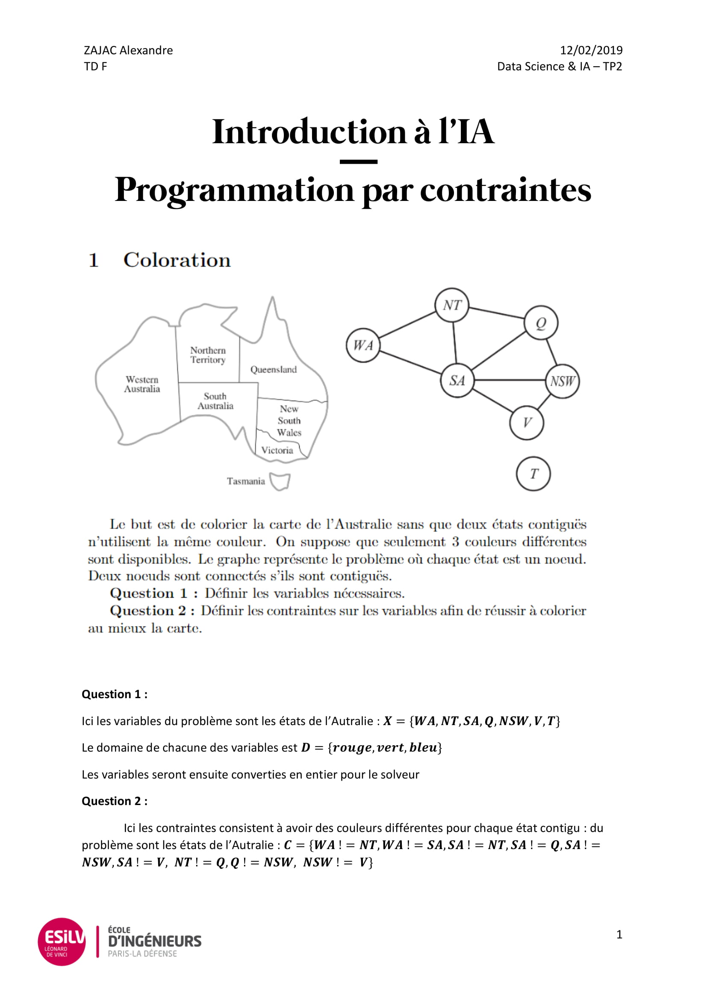
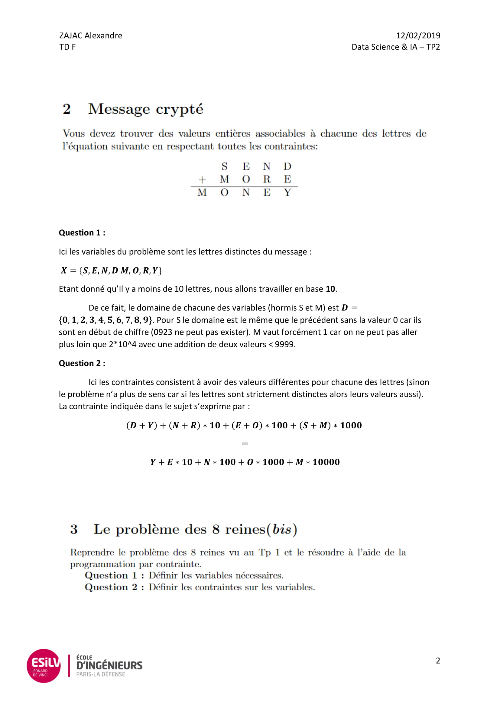
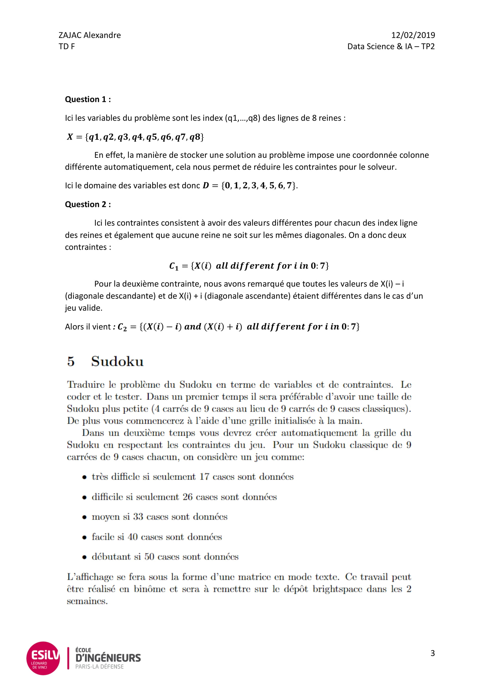
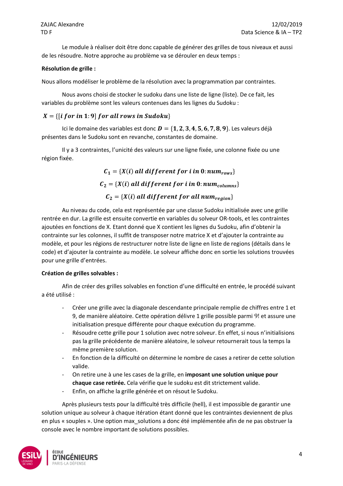

# Constraint programming

This project was realized for the Introduction to DataScience course @ESILV university.

## Description 
It implements the constraint programming library ORtools to solve classical problems like 3-col, nqueens and cryptarithmetic. 
It also resolves a Sudoku with constraint programming.

## Docs

